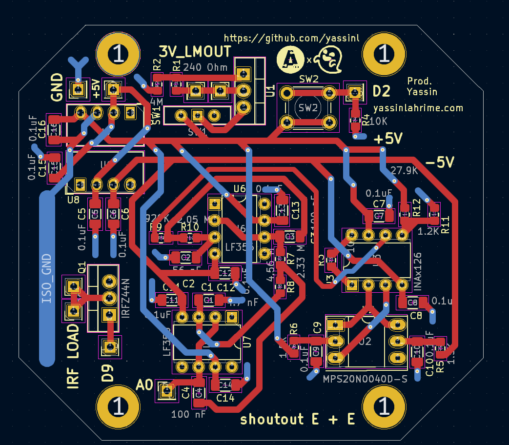

## Members
Yassin Lahrime, Computer Engineering Student (2026)
yassinl@vt.edu

## Mentor
Rusty :3

## Current Status
IN PROGRESS

## Project Overview

Portable Blood pressure and heart rate monitoring device.
Started as Fall 2024 IDP Project--Continued as an AMP Lab Project.

## Educational Value Added

PCB Design--Rapid Prototyping--CAD--Arduino

## Tasks

Schmematics, PCB routing, Parts order, Design Iterations, Prototyping....

## Design Decisions

Using a portable USB power bank as to supply power. Ideally I would create my own power supply with custom charging and discharging circuits but this project has dragged on for too long and making the circuit custom with 18650 or lipo cells would not be as reliable as buying a USB power bank off the shelf. 

## Design Misc

## Steps for Documenting Your Design Process

Mainly just using the engineering notebook from IDP Fall 2024 and kicad schematics.

## BOM + Component Cost

Whole project should be less than 100 dollars 

## Timeline

Project should be done by the end of spring 2025 (need some more prototyping and design iterations)🤞

