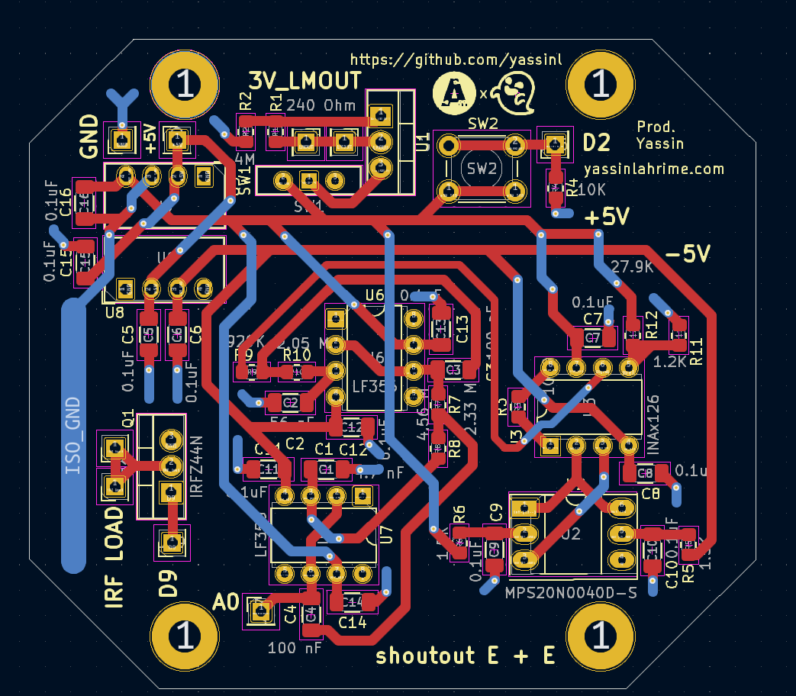

## Members
Yassin Lahrime, Computer Engineering Student (2026)
yassinl@vt.edu

## Mentor
Tyler Wells :3

## Current Status
IN PROGRESS

## Project Overview

Portable Blood pressure and heart rate monitoring device.
Started as Fall 2024 IDP Project--Continued as an AMP Lab Project.

## Educational Value Added

PCB Design--Rapid Prototyping--CAD--Arduino

## Tasks

Schmematics, PCB routing, Parts order, Design Iterations, Prototyping....

## Design Decisions

Still working out how im going to power the device-- originally i thought i would just use a portable USB charger because thats the quickest and easiest solution but maybe ill use 18650 cells. Im not sure if I want to deal with the hassle of creating a charging circuit for that though. 

## Design Misc

## Steps for Documenting Your Design Process

Mainly just using the engineering notebook from IDP Fall 2024 and kicad schematics.

## BOM + Component Cost

Whole project should be less than 100 dollars 

## Timeline

Project should be done by the end of spring 2025 (need some more prototyping and design iterations)🤞

